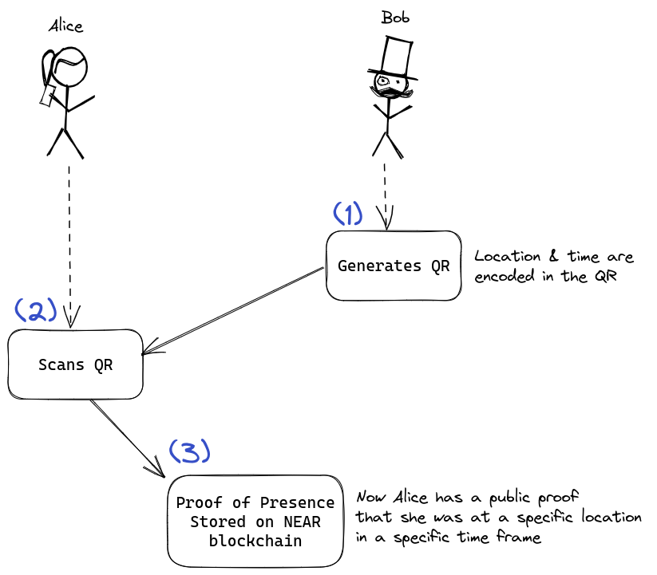

# PoPskl

Proof of Presence done right.

Main idea of the project is to create an application with which person can prove to other(s) being at some place at some moment in time.

At the moment project consists of two parts: [contract](./contract/) and [dApp](./popskl/).
For actual usage consult corresponding readmes.

## User flow

