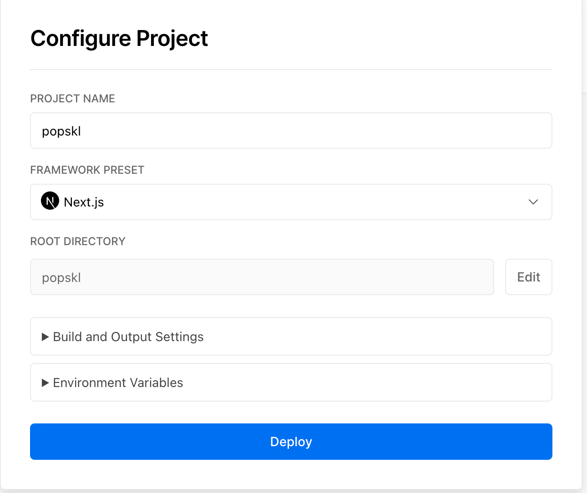

# PoPskl dApp

Proof of Presence done right.

Main idea of the project is to create an application with which person can prove to other(s) being at some place at some moment in time.

## User flow


For now, actual proof doesn't contain location & time. Contract just counts the number of times user submitted code.

## Getting Started

First, run the development server:

```bash
npm run dev
```

Open [http://localhost:3000](http://localhost:3000) with your browser to see the result.

You can start editing the page by modifying `pages/index.tsx`. The page auto-updates as you edit the file.

## Deployment to Vercel

Go to Vercel and sign in with your GitHub
Then click on New Project button and then select popskl repo

When configuring your new project, Vercel will allow you to customize your Root Directory
Click Edit next to Root Directory and set it to popskl
Select the Framework as Next.js
Click Deploy



Now you can see your deployed website by going to your dashboard, selecting your project, and copying the URL from there!

